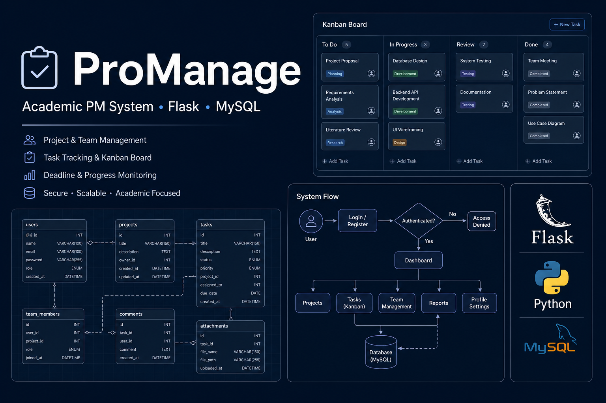

# ProManage — Portfolio Overview

**Academic project (ICT301)** · King's Own Institute · Team of 5 — Flask-based **project management platform** for academic workflows.

## My contribution (Habib Khan)

| Area | Deliverable |
|------|-------------|
| **Requirements** | Use-case narratives, functional requirements, scope boundaries |
| **Data design** | ERD (entities: users, projects, tasks, milestones, roles) |
| **Process design** | System flowcharts (auth, task assignment, milestone approval) |
| **UI/UX** | Wireframes for dashboard, project board, and task detail views |
| **Backend skeleton** | Flask app structure, SQLAlchemy models aligned to ERD, Flask-Login auth scaffold |

Other teammates owned complementary modules per the team charter; this repo documents **my** design artifacts and the shared architecture.

## Screenshots

| Design overview |
|:---:|
|  |

## Scope

- Requirements specification and use-case modeling
- ERD and system flowcharts
- UI wireframes and Flask application skeleton

## Stack

- Python · Flask · Flask-Login · Flask-SQLAlchemy
- MySQL (PyMySQL)
- Jinja2 templates

## Full implementation

Team implementation code may live in a separate **`ProManage`** repo. This **portfolio** repo is the recruiter-facing showcase of design and architecture.

## Architecture

See [docs/architecture.md](docs/architecture.md).

## Author

**Habib Khan** — Requirements · Data model · Flowcharts · Wireframes · Auth scaffold · King's Own Institute
